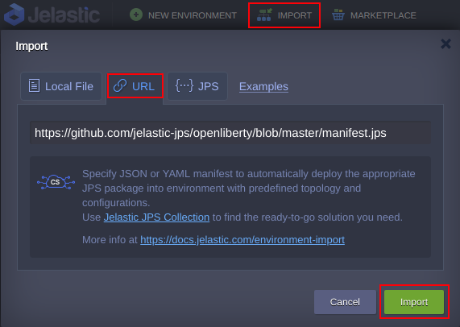
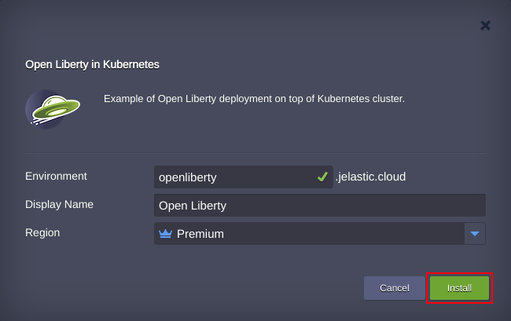
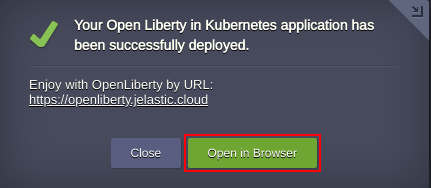
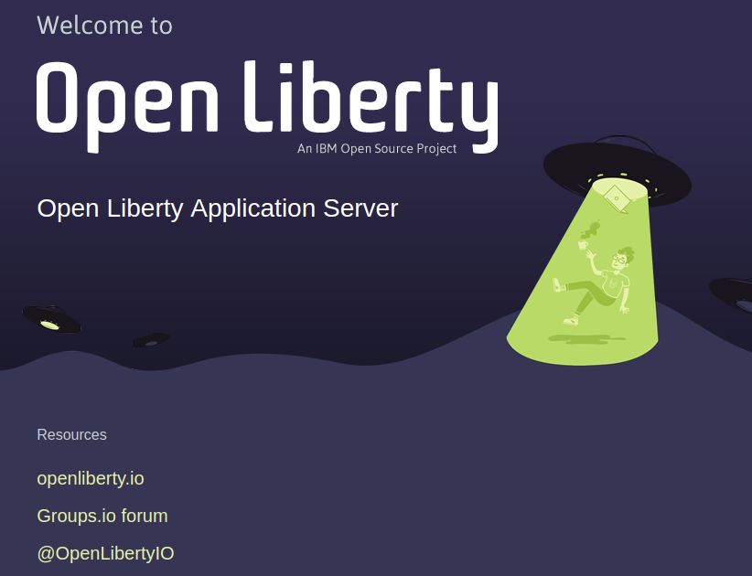
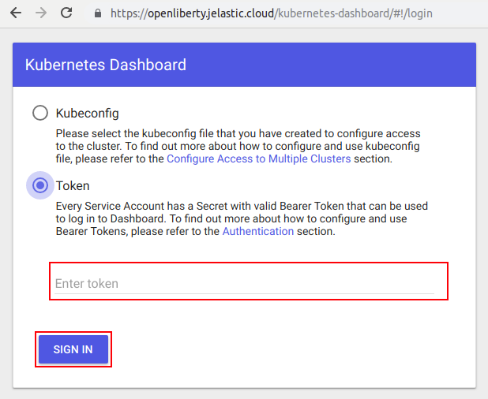
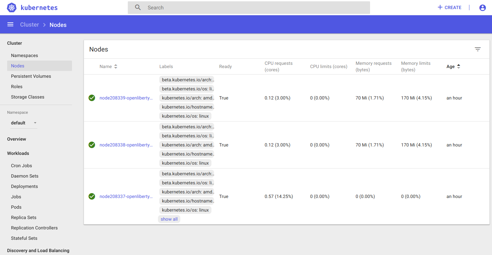

 
# Open Liberty in Kubernetes Cluster

Open Liberty is a small, flexible and lightweight application server runtime for building cloud-native apps and microservices. It supports the full MicroProfile and Java EE APIs and is composable. It deploys to every major cloud platform such as Cloud Foundry, Docker and Kubernetes.
With this repository, the Open Liberty is installed on the top of Kubernetes cluster.

Import the required manifest using the link from GitHub:
[https://github.com/jelastic-jps/openliberty/blob/master/manifest.jps](https://github.com/jelastic-jps/openliberty/blob/master/manifest.jps)

First, manifest installs Kubernetes Cluster.
Second, the Open Liberty is installed on Kubernetes.

 

In the installation wizard, if required, change settings such as *Environment Name* or *Region*. Then press __Install__ .

 

After the completion press __Open in Browser__ button.   

 

 

To access Kubernetes dashboard, use the link and access token from respective email.

 

 

## Deploy Now

Press __Deploy__ to get an account and deploy to a certified Jelastic partner from the distributed network of independent data center service providers. 

 

## Openliberty Managed Hosting Business

To start offering this solution to your customers please follow to [Managed PaaS Hosting Business](https://jelastic.com/apaas/) 
